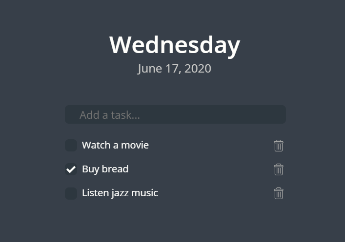

# ToDo list

## Table of contents
* [Screenshots](#screenshots)
* [Technologies](#technologies)
* [Setup](#setup)
* [Status](#status)
* [Contact](#contact)


## Screenshots


## Technologies
* React, Redux, Redux Toolkit

## Setup
```javascript
npm i
npm start
```

## Code Examples
Show examples of usage:
```javascript
    setChecked: (state, action) => {
      state.list
      .filter(item => item.id === action.payload)
      .map(item=> item.checked = !item.checked);
      window.localStorage.setItem('list', JSON.stringify(state.list))
    }

```


## Status
Project is: _in progress_
I will improve and add new functionality for this project.

## Contact
Created by [@filicaliva](https://www.linkedin.com/in/vfilimonchuk/) - feel free to contact me!